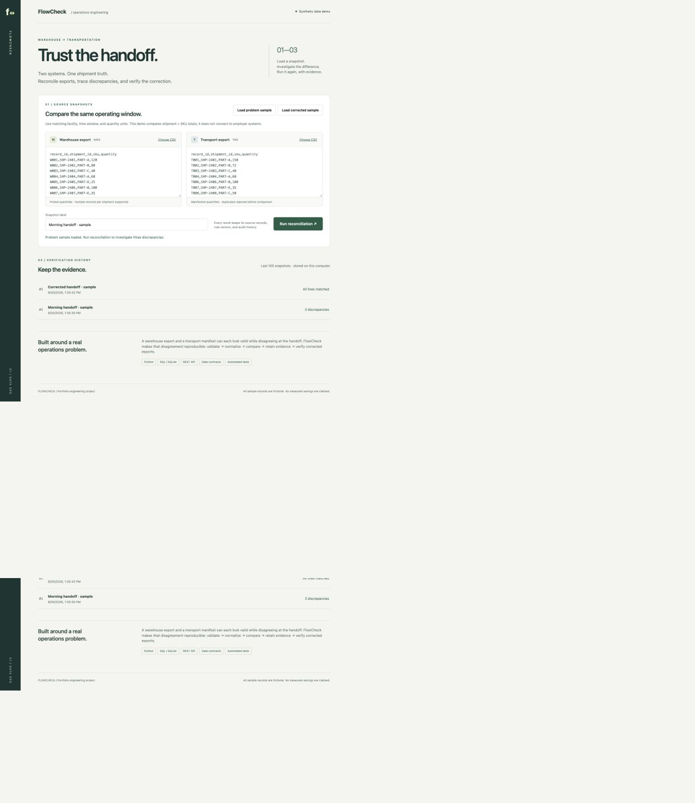

# FlowCheck

**A WMS/TMS reconciliation workbench for technical operations.**

Warehouse picks and transportation manifests can disagree even when both exports are valid. FlowCheck validates both snapshots, aggregates split lines, compares shipment + SKU quantities, and saves reproducible evidence for investigation and verification.

This portfolio project draws on warehouse and transportation systems experience. All fixtures are fictional; it contains no employer data, live integrations, or claims of measured savings.



## Public demo

[Try FlowCheck in your browser](https://sfskhalsa101.github.io/flowcheck/) — no account or installation needed. The public version performs comparisons in JavaScript and stores source records and history in your browser’s local storage. Files are not uploaded to a backend. Use one tab at a time; this demo does not synchronize across devices or users. Browser storage limits apply.

The Python/SQLite implementation below remains the backend reference. Shared fixtures and randomized cases test comparison parity between both versions. Rebuild the public version with `python3 build_demo.py`; GitHub Pages serves `main` → `/docs`.

## Run in one command

Requires Python 3.11 or newer. No dependencies, API keys, or package installation.

```sh
python3 server.py
```

Open **http://127.0.0.1:8765**. The application binds only to your computer. Use `--port 8766` if needed. SQLite data is created under ignored `work/`; `--db path/to/file.db` selects a different database.

## Two-minute demonstration

1. Click **Run reconciliation** with the preloaded problem sample. Expect **6 matched keys, 3 discrepancies, 540 warehouse units, and 525 transport units**.
2. Inspect quantity mismatch SHP-2402 (80 vs 72), missing transport record SHP-2405, and transport-only SHP-2499. Each includes a suggested investigation step.
3. Export the discrepancy CSV and expand the audit trail.
4. Run the same inputs again. The original snapshot is reused; its audit trail records the retry.
5. Click **Load corrected sample**, then run again. Expect **8 matched keys, no discrepancies, 540 units per system**. The original result stays available in history.
6. Add a duplicate record ID to an input and run again. Validation rejects the entire batch before any database write.

The corrected sample illustrates upstream repair; FlowCheck does not edit source systems or automatically republish messages.

## What this demonstrates

| Technical skill | Evidence in the repository |
| --- | --- |
| Translating operating requirements | Explicit scope, data contract, three deterministic discrepancy rules |
| Python and data validation | CSV parsing, bounded input, duplicate rejection, split-line aggregation |
| SQL and data modeling | Relational source records, unique batch fingerprint, audit events, reporting queries |
| API development | JSON comparison endpoint, run history, detail endpoint, CSV export |
| Reliability | Atomic transactions, content-based idempotency, concurrent retry test |
| Troubleshooting | Source quantities, delta, rule version, provenance and investigation steps |
| Delivery | Responsive interface, reproducible fixtures, automated tests, GitHub Actions |

## Portfolio fit

The existing [operations portfolio](https://sfskhalsa101.github.io/hari-simran-khalsa-portfolio/) has a sort staffing and door-assignment simulator, dispatch exception dashboard, and AIncident product case study. FlowCheck adds **cross-system data integrity and reproducible reconciliation**. It does not model staffing, prioritize dispatch service risks, or generate incident summaries. See [the scope comparison](docs/portfolio-fit.md).

## Data contract

Both exports must have exactly these columns in this order:

```csv
record_id,shipment_id,sku,quantity
W001,SHP-2401,PART-A,120
```

- Use complete snapshots from the **same facility and operating window**, with the same units of measure. These conditions are operator responsibilities; the CSV does not encode or verify them.
- IDs are case-sensitive: 1–64 characters, starting with a letter or number; remaining characters may include `_`, `.`, and `-`. Leading/trailing whitespace is removed. UTF-8 BOM is accepted.
- `record_id` is unique within each source. Multiple distinct records may share a shipment + SKU; their quantities are summed.
- Quantity is an integer from 1 to 1,000,000. Returns, cancellations, negative adjustments, and zero quantities are outside this contract.
- Each source permits 1–5,000 records and at most 500 KB. A malformed row rejects the entire snapshot pair, preventing misleading partial totals.
- WMS is the comparison reference, **not an assertion of physical truth**. Delta is TMS minus WMS. Matching totals do not prove correct contents, timing, or physical delivery.
- Identity is a SHA-256 digest of normalized, record-ID-sorted inputs plus rule version. Label and row order do not affect identity. A reused snapshot retains its original label; distinct IDs are retained as distinct evidence even when totals agree.

## Test

```sh
python3 -m unittest discover -s tests -v
node --test tests/browser.test.cjs
```

The suite covers seeded discrepancies, corrected reconciliation, invalid data, composite keys, source preservation, concurrent retries, API responses, CSV export, and rejected cross-origin writes. GitHub Actions runs the suite on Python 3.11–3.13.

## Architecture

```text
CSV files / editor → bounded JSON API → validate → normalize & aggregate
                                              → deterministic rules
                                              → SQLite transaction
                                              → result / audit / CSV export
```

- `flowcheck/engine.py`: pure parsing and comparison functions.
- `flowcheck/store.py` and `schema.sql`: transactional persistence and provenance.
- `server.py`: small standard-library HTTP API and an explicit static-file allowlist.
- `static/`: dependency-free browser interface. Imported text is inserted with `textContent`, never HTML.
- `samples/`: reproducible broken and corrected export pairs.
- `docs/`: SQL investigation queries, operating runbook, and interview walkthrough.

### API

| Method | Path | Behavior |
| --- | --- | --- |
| POST | `/api/runs` | JSON `{label, warehouse, transport}` with CSV strings; 201 new, 200 reused, 400 invalid |
| GET | `/api/runs` | Latest 100 saved snapshots |
| GET | `/api/runs/{id}` | Result, summary, fingerprint and audit trail |
| GET | `/api/runs/{id}/export` | Discrepancy CSV; a matching run exports headers only |

## Deliberate limits

This is a **local, single-user portfolio application**, not a production service. It has no authentication, scheduler, upstream adapters, access roles, tamper-proof audit log, or automatic remediation. The built-in HTTP server must not be exposed publicly. Input records and audit history persist on the local computer. Rejected batches return actionable errors but are not retained. Database users can alter history; “audit trail” describes application evidence, not regulatory compliance.

Production extensions would add an authenticated API server, deployment hardening, schema migrations, explicit facility/window metadata, decimal quantities where required, source-system connectors, retention policy, and monitored ingestion. They are intentionally not claimed as implemented features.
